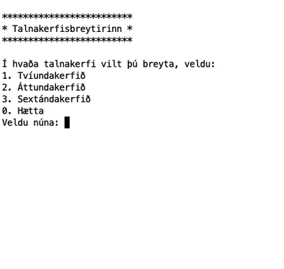

# KEST1VL - Tímaverkefni (15%)

## Talnakerfi - Haust 2022

**Athugið að verkefnið er einstaklingsverkefni.** Ef tveir eða fleiri skila sömu lausninni verður gefið 0 (núll) fyrir þær lausnir.

Skilið lausninni (.py skránni) í skilahólf verkefnisins á Innu fyrir lok tímans.

## Talnakerfisbreytir

Skrifið forrit í Python sem breytir tölum úr tugakerfinu í tvíundar-, áttunda- eða sextándakerfið eftir vali notanda.

Forritið á að byrja á að sýna valmynd þar sem notandinn getur valið um í hvaða talnakerfi hann vill breyta auk þess að bjóða notandanum að hætta keyrslu forritsins. Ef notandinn velur eitthvað annað en það sem í boði er skal birta viðeigandi villuskilaboð og biðja notandann að velja aftur.

Ef notandinn velur ekki að hætta keyrslu forritsins skal forritið biðja notandann um að slá inn tölu í tugakerfinu. Þegar notandinn hefur slegið inn töluna á forritið að sýna töluna í því talnakerfi sem notandinn valdi í valmyndinni ásamt því að sýna hana í tugakerfinu.

Að lokum á svo valmyndin að birtast aftur.

### Dæmi um útfærslu

